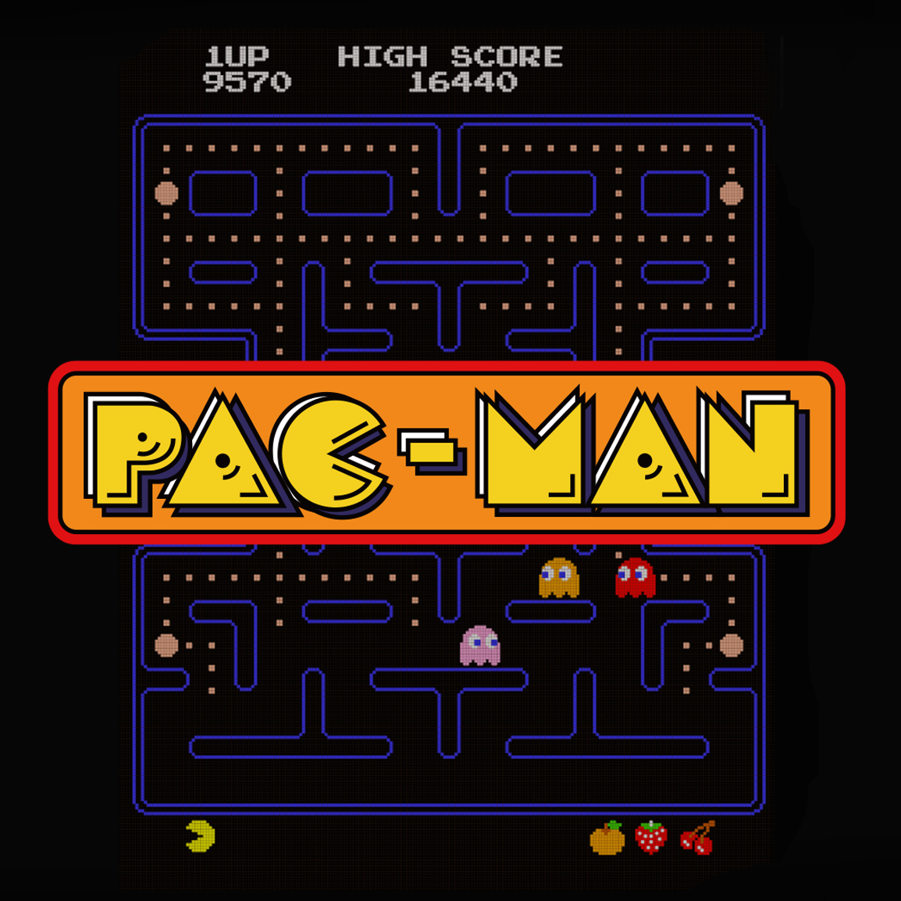
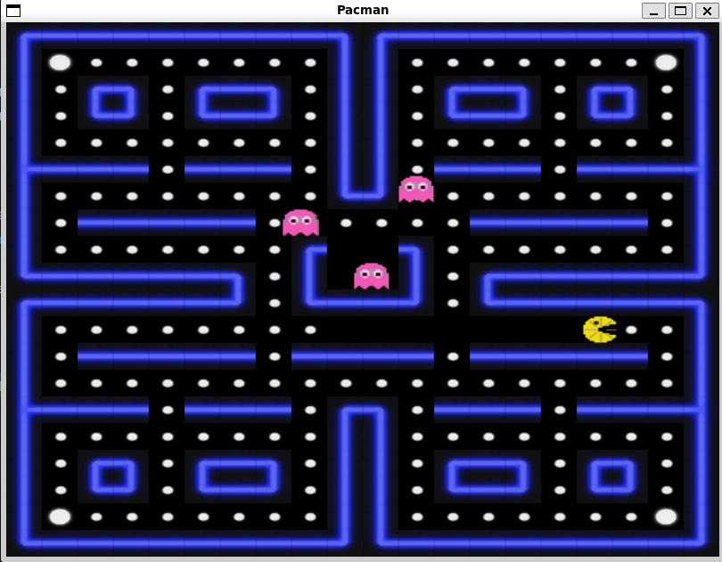

# Pacman Game

This is a simple implementation of the classic Pacman game using C and OpenGL. The game features basic gameplay mechanics, including Pacman moving through a maze, collecting points, and avoiding ghosts.

 

## Features

- Pacman can move in four directions: up, down, left, and right.
- Ghosts move around the maze and try to catch Pacman.
- Pacman can collect points and power-ups.
- The game includes a start screen and a game over screen.

## Requirements

- GCC (GNU Compiler Collection)
- OpenGL
- GLFW
- SOIL (Simple OpenGL Image Library)

## Installing OpenGL, GLFW, and SOIL Headers on Ubuntu

On Ubuntu, you don't need to manually download and place header files in `/usr/include`. Instead, use the package manager (`apt`) to install the required development packages, which ensures that all headers and related libraries are correctly placed in system directories.

### Step 1: Update Your Package List and Install Build Tools
Before installing the necessary libraries, update your package list and install essential build tools:

```bash
sudo apt-get update
sudo apt-get install build-essential
```

This installs compilers and tools required for compiling C/C++ programs.

### Step 2: Install OpenGL and GLU Development Files
The OpenGL headers (`GL/gl.h`) and GLU (`GL/glu.h`) are provided by the Mesa package. Install them using:

```bash
sudo apt-get install libgl1-mesa-dev libglu1-mesa-dev
```

These packages ensure OpenGL and GLU headers and libraries are installed in `/usr/include/GL`.

### Step 3: Install GLFW Development Package
GLFW (`GLFW/glfw3.h`) is needed for OpenGL windowing. Install it with:

```bash
sudo apt-get install libglfw3-dev
```

This places GLFW headers in the system include paths.

### Step 4: Install SOIL Development Package
The SOIL (Simple OpenGL Image Library) headers (`SOIL/SOIL.h`) can be installed using:

```bash
sudo apt-get install libsoil-dev
```

This ensures SOIL headers and libraries are properly installed.

### Step 5: Verify Installation
To confirm that the headers are correctly installed, you can check their locations:

```bash
ls /usr/include/GL    # OpenGL headers
ls /usr/include/GLFW  # GLFW headers
ls /usr/include/SOIL  # SOIL headers
```

## Installation

1. Clone the repository:
    ```sh
    git clone https://github.com/yourusername/Pacman_C.git
    cd Pacman_C
    ```

2. Build the project using the provided Makefile:
    ```sh
    make
    ```

## Usage

1. Run the game:
    ```sh
    make run
    ```

2. Use the arrow keys to move Pacman:
    - Right arrow: Move right
    - Down arrow: Move down
    - Left arrow: Move left
    - Up arrow: Move up

3. Press `P` to start the game from the start screen.

4. Press `ESC` to exit the game.

## Project Structure

- `main.c`: Contains the main game loop and initialization code.
- `Pacman.c`: Contains the implementation of Pacman, ghosts, and the game scenario.
- `Pacman.h`: Header file with function declarations and data structures.
- `Makefile`: Build script to compile the project.


## Acknowledgements

- Used open source assets in github.
- The game uses the Simple OpenGL Image Library (SOIL) for loading textures.
- The game is inspired by the classic Pacman game developed by Namco.
